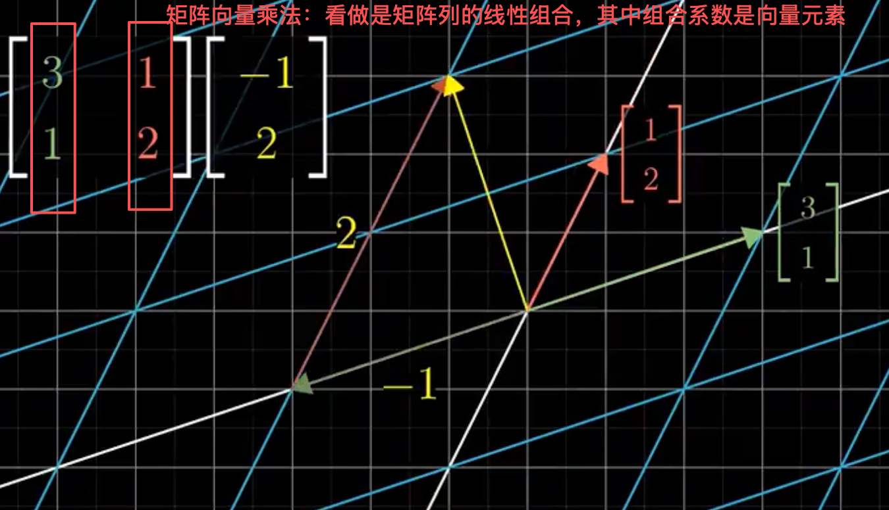

线性代数的本质

课程大纲：

- 第1章：向量是什么？
- 第2章：向量的线性组合、张成的空间与基
- 第3章：线性变换与矩阵
- 第4章：线性变换复合与矩阵乘法
- 第5章：行列式
- 第6章：逆矩阵、列空间与零空间
- 第7章：点积与叉积
- 第8章：基变换
- 第9章：特征向量与特征值
- 第10章：抽象向量空间 

 

---

# 【1】向量究竟是什么？

1）向量定义1：指空间中的箭头，以原点为起点，有自己的方向与长度；

2）线性代数：围绕两种基本运算，包括向量加法与向量数乘；

2）向量定义2：指有序的数字列表（计算机视角）；

- 向量：看做是一种特定运动；
- 向量加法：把对应项目加起来；
- 向量数乘：向量与标量相乘指向量每个分量都乘以标量；

 

---

# 【2】向量的线性组合、张成的空间与基

1）通过改变所选择的标量，基向量与标量相乘，可以得到所有的二维向量； 

2）线性代数中的线性定义？以及线性与直线的区别？

- 线性定义：在二维空间中，若固定一个向量的标量，而让另一个向量的标量自由变化，两个向量组合所产生向量的终点会描出一条直线；
- 如果让两个基的标量同时变化：有3种情况；
  - 情况1：所产生的向量能够到达二维空间中的每一个点；
  - 情况2：当两个向量共线时（方向相同），则所产生向量的终点被限制在一条过原点的直线上；
  - 情况3：当两个向量都是零向量，则所产生向量的终点只能是原点或零点；

3）给定向量张成的空间定义：所有可以表示为给定向量线性组合的向量的集合；

【例】张成的空间：$\vec{v}$与$\vec{w}$  全部线性组合构成的向量集合称为张成的空间（张成可以理解为构成或组成）
$$
a\vec{v}+b\vec{w}
$$
 

---

## 【2.1】向量与点

1）使用向量的终点表示该向量，因为起点全部是原点；

- 当考虑一个向量时，把该向量看做箭头；
- 当考虑多个向量时，把它们都看做点；

 

---

## 【2.2】三维空间中向量的张成（组合）

1）三维空间中两个向量张成的空间就是它们所有可能的线性组合；

2）三维空间中两个向量的张成定义：改变线性组合中的两个标量，把缩放后的向量相加，然后跟着最终向量的终点走，这个终点会画出三维空间中某个过原点的平面；

- 确切的说，所有终点落在这个平面上的向量的集合是这两个向量张成的空间；

3）如果把两个向量增加到三个向量，那么这3个向量张成的空间是什么？

4）3个向量的线性组合：选择3个标量，对3个向量分别进行缩放，然后把结果相加，构成这3个向量张成的空间；

- 有两种情况：
  - 情况1：第3个向量恰好落在前面2个向量所张成的平面上，那么这3个向量张成的空间与前2个向量张成的空间相同； 
  - 情况2：第3个向量不落在前面2个向量所张成的平面上，那么这3个向量的组合能够表示三维空间中的任何一个向量；
    - 当我们缩放第3个向量时，它会将前2个向量组成的平面沿它的方向来回移动，从而扫过整个三维空间；

5）特殊情况

- 第3个向量落在前面2个向量张成的空间中，或2个向量恰好共线的情况，即一组向量中至少有一个向量是多余的，没有对张成空间做出任何贡献；

 

---

## 【2.3】线性相关

1）线性相关定义：有n个向量，移除其中一个而不减少其他n-1个向量张成的空间，则称n-1个向量是线性相关；

- 另一种定义是：其中一个向量是其他n-1个向量的线性组合，因为这个向量已经落在其他n-1个向量张成的空间中；

 

---

## 【2.5】线性无关

1）线性无关定义：n个向量给张成空间都添加了新的维度，则称这n个向量是线性无关的；

- 或者说，n个向量张成的空间的维度是n，则称这n个向量是线性无关的； 

 

---

## 【2.6】基的严格定义 

1）基的严格定义： 向量空间的一组基是张成该空间的一个线性无关向量集；

 

---

# 【3】矩阵与线性变换

## 【3.1】线性变换

1）线性变换解释：

- 变换：本质上是函数的花哨说法；
  - 使用变换这个术语：是在暗示以特定方式来可视化这一输入-输出关系；
  - 一种理解向量的函数的方法：使用运动；
- 理解变换：一个输入向量移动到输出向量的位置； 
  - 以二维空间为例，向量都用箭头表示会非常拥挤，一个技巧是把向量表示为向量终点，而不是一个箭头；用这种方法考虑所有输入向量都移动到输出向量的位置时，我们只用看空间中的所有点移动到其他点的位置；

2）线性变换定义（严格意义上说，线性变换是将向量作为输入与输出的一类函数；线性变换也可以看做是对空间的挤压伸展，它保持网格线平行且等距分布，并且保持原点不变；关键点在于，线性变换由它对空间的基向量的作用完全决定；在二维空间中，基向量就是 $\hat{i},\hat{j} $）：

- 各种各样对空间的变换是非常复杂多样的；如挤压或变形空间；但线性代数限制在一种特殊类型的变换上；这种变换更容易理解，称为线性变换；
- 线性变换定义：若一个变换具有如下2个性质，则称该变换是线性变换；
  - 性质1：直线在变换后仍然是直线，不能弯曲；
  - 性质2：原点必须保持固定；
- 总结：线性变换指保持网格线平行且等距分布的变换；

3）向量的线性变换过程：

【图解】上述线性变换的公式如下：

【补充】

- 通过上述线性变换公式，给定任何一个输入向量，我们都知道线性变换后的位置； 

4）一个二维线性变换，仅由4个数字可以完全确定，即变换后$\hat{i}$的2个坐标与变换后$\hat{j}$的2个坐标；

- 通常：我们把这4个坐标值包装在一个2*2的格子中，称为为2\*2的矩阵。

$$
\begin{bmatrix}
3 & 2 \\ 
-2 & 1
\end{bmatrix}
$$

 

---

## 【3.2】线性变换矩阵（示例）

1）如果你有一个描述线性变换的2*2矩阵，以及一个给定向量。你想了解线性变换矩阵对这个给定向量的变换效果，则只需要取出给定向量的坐标，将它们与矩阵的特定列相乘，然后把结果相加即可，如下图所示。

 

---

### 【3.2.1】线性变换过程（非常重要）

1）考虑变换后的第1个基向量坐标为(a,c)，变换后的第2个基向量坐标为(b,d)，我们让这个变换作用于输入向量$v=(x,y)$，则变换的计算过程如下：

变换后的2个基向量组成线性变换矩阵，如下：
$$
M=\begin{bmatrix}
a & b \\
c & d 
\end{bmatrix}
$$
输入向量v=$\begin{bmatrix}x \\ y\end{bmatrix}$

则线性变换矩阵M对向量v执行线性变换过程，如下：
$$
x\begin{bmatrix} a \\ c \end{bmatrix} + y\begin{bmatrix} b \\ d \end{bmatrix}=\begin{bmatrix} ax+by \\ cx+dy \end{bmatrix}
$$
2）上述过程也可以看做是矩阵向量乘法，如下（矩阵放在向量左边，类似与一个函数）。
$$
\begin{bmatrix} a & b \\ c & d \end{bmatrix} \begin{bmatrix} x \\ y \end{bmatrix} =x\begin{bmatrix} a \\ c \end{bmatrix} + y\begin{bmatrix} b \\ d \end{bmatrix}=\begin{bmatrix} ax+by \\ cx+dy \end{bmatrix}
$$

3）矩阵列看做变换后的基向量；

4）矩阵向量乘法：看做是矩阵列的线性组合，其中组合系数是向量元素；

 

---

### 【3.2.2】练习：用矩阵描述线性变换

1）例1：把坐标轴逆时针旋转90度；

- 旋转前的基向量：$\hat{i}=(1,0), \hat{j}=(0,1)$
- 旋转后的基向量：$\hat{i}=(0,1), \hat{j}=(-1,0)$
- 则变换后的基向量$\hat{i},\hat{j} $组成的线性变换矩阵$M=\begin{bmatrix}0 & -1 \\ 1 & 0\end{bmatrix}$

如果想计算任意向量$v=\begin{bmatrix}x \\ y\end{bmatrix}$在逆时针旋转90度后的位置，你只需要把该向量v与矩阵M相乘即可。
$$
\begin{bmatrix}0 & -1 \\ 1 & 0\end{bmatrix}\begin{bmatrix}x \\ y\end{bmatrix}=x\begin{bmatrix}0 \\ 1 \end{bmatrix} + y\begin{bmatrix} -1 \\ 0 \end{bmatrix}=\begin{bmatrix}0*x-y \\ 1*x + 0*y \end{bmatrix}=\begin{bmatrix}-y \\ x \end{bmatrix}
$$
2）例2：剪切变换：

- $\hat{i}不变，坐标还是为(1,0)； \hat{j}移动到坐标(1,1)$；线性变换矩阵$M=\begin{bmatrix} 1 & 1 \\ 0 & 1 \end{bmatrix}$
- 为计算任意向量$v=\begin{bmatrix}x \\ y\end{bmatrix}$在剪切变换后的位置，你只需要把该向量v与矩阵M相乘即可
- $\begin{bmatrix} 1 & 1 \\ 0 & 1 \end{bmatrix}\begin{bmatrix}x \\ y\end{bmatrix}=x\begin{bmatrix}1 \\ 0\end{bmatrix}+y\begin{bmatrix} 1 \\ 1 \end{bmatrix}=\begin{bmatrix}x+y \\ y\end{bmatrix}$

 

---

3）例3：给定两个向量$v1=\begin{bmatrix}1 \\ 2\end{bmatrix}, v2=\begin{bmatrix} 3 \\ 1 \end{bmatrix}$，则这2个向量组成的线性变换矩阵$M=\begin{bmatrix} 1 & 3 \\ 2 & 1 \end{bmatrix}$ 表示的线性变换是怎样的？

- 把基向量$\hat{i}移动到(1,2)，\hat{j}移动到(3,1)$，且空间其他部分随着$\hat{i}与\hat{j} $一起移动，以保持网格线平行且等距分布；
  - 若变换（移动后）后的$\hat{i},\hat{j} $是线性相关的（列线性相关），则其中一个向量是另一个向量的倍数； 那么这个线性变换将整个二维空间挤压到一条直线上（也就是这2个线性相关向量所张成的一维空间）； 

 

---

## 【3.3】总结（矩阵就是空间的一种特定变换形式）

1）线性变换：是操作空间的一种手段； 它保持网格线平行且等距分布，并且保持原点不动；

- 线性变换：通过几个数字（即变换后基向量坐标）就可以描述清楚； 
  - 以这些坐标为列构成的线性变换矩阵为我们提供一种描述线性变换的语言； 
  - 而矩阵向量乘法就是计算线性变换作用于给定向量的一种途径；

2）矩阵：每当看到一个矩阵时，都可以把它解读为空间的一种特定变换（非常精辟）；

- 当你把矩阵看做空间变换后，此后几乎所有主题，从矩阵乘法到行列式，基变换，特征值等都会更加容易理解；

 

---

# 【4】矩阵乘法与线性变换复合的联系 

## 【4.1】复合变换

1）复合变换：指多次线性变换；如逆时针旋转90度，再执行剪切变换；

- 旋转+剪切前的基向量：$\hat{i}=(1,0), \hat{j}=(0,1)$
- 旋转+剪切后的基向量：$\hat{i}=(1,1), \hat{j}=(-1,0)$
- 旋转+剪切后的复合变换矩阵$M=\begin{bmatrix}1 & -1 \\ 1 & 0 \end{bmatrix}$，复合线性变换矩阵M描述了先旋转再剪切的复合变换效应；

2）对于旋转+剪切复合线性变换，可以先左乘旋转矩阵，然后再左成剪切矩阵，如下。（两次线性变换结果，应该与一次复合矩阵变换的效果相同）
$$
\begin{bmatrix} 1 & 1 \\ 0 & 1\end{bmatrix} \begin{bmatrix}0 & -1 \\ 1 & 0\end{bmatrix}\begin{bmatrix} x \\ y \end{bmatrix}=\begin{bmatrix}1 & -1 \\ 1 & 0\end{bmatrix}\begin{bmatrix} x \\ y \end{bmatrix}
$$

 

3）复合线性变换矩阵：应该是旋转线性变换矩阵左乘剪切线性变换矩阵；

- 两个矩阵相乘的几何意义（如旋转矩阵左乘剪切矩阵）：指两个线性变换的相继作用；

 

 

---

## 【4.2】矩阵乘法（基于矩阵向量乘法）

1）给定向量M1，M2，则M1左乘M2计算过程如下：
$$
M_1=\begin{bmatrix} 1 & -2 \\ 1 & 0 \end{bmatrix} , 
M_2=\begin{bmatrix} 0 & 2 \\ 1 & 0 \end{bmatrix}
$$
则M1左乘M2计算过程如下：
$$
M_2M_1=\begin{bmatrix} 0 & 2 \\ 1 & 0 \end{bmatrix}\begin{bmatrix} 1 & -2 \\ 1 & 0 \end{bmatrix} \\
$$
计算步骤如下：
第1步：$M_1$第1列$\begin{bmatrix} 1 \\ 1\end{bmatrix}$使用$M_2$表示的线性变换后得到如下结果。
$$
\begin{bmatrix} 0 & 2 \\ 1 & 0 \end{bmatrix}\begin{bmatrix} 1  \\ 1  \end{bmatrix} =1\begin{bmatrix} 0 \\ 1 \end{bmatrix}+1\begin{bmatrix} 2 \\ 0 \end{bmatrix}=\begin{bmatrix} 2 \\ 1 \end{bmatrix}
$$
第2步：$M_1$第2列$\begin{bmatrix} -2 \\ 0 \end{bmatrix}$使用$M_2$表示的线性变换后得到如下结果。

$$
\begin{bmatrix} 0 & 2 \\ 1 & 0 \end{bmatrix}\begin{bmatrix} -2  \\ 0  \end{bmatrix} =(-2)\begin{bmatrix} 0 \\ 1 \end{bmatrix}+0\begin{bmatrix} 2 \\ 0 \end{bmatrix}=\begin{bmatrix} 0 \\ -2 \end{bmatrix}
$$
综上：等式9的结果如下。
$$
M_2M_1=\begin{bmatrix} 0 & 2 \\ 1 & 0 \end{bmatrix}\begin{bmatrix} 1 & -2 \\ 1 & 0 \end{bmatrix} =\begin{bmatrix}2 & 0 \\ 1 & -2\end{bmatrix}
$$
 

---

### 【4.2.1】矩阵乘法的普适性

1）把上述矩阵$M_1$替换为符号$\begin{bmatrix} e & f \\ g & h\end{bmatrix}$，把$M_2$替换为$\begin{bmatrix}a & b \\ c & d\end{bmatrix}$。则$M_1$左乘$M_2$的计算过程如下：

第1步：$M_1$第1列左乘$M_2$如下：
$$
\begin{bmatrix}a & b \\ c & d\end{bmatrix}\begin{bmatrix}e \\ g\end{bmatrix}=e\begin{bmatrix}a \\ c\end{bmatrix}+g\begin{bmatrix}b \\ d\end{bmatrix}=\begin{bmatrix} ac+bg \\ ce+dg \end{bmatrix}
$$

第2步：$M_1$第2列左乘$M_2$如下：
$$
\begin{bmatrix} a & b \\ c & d \end{bmatrix}\begin{bmatrix} f \\ h \end{bmatrix}=f\begin{bmatrix}a \\ c\end{bmatrix}+h\begin{bmatrix} b \\ d\end{bmatrix}=\begin{bmatrix} af+bh \\ cf+dh \end{bmatrix}
$$
综上：$M_1$左乘$M_2$的乘积结果如下：
$$
M_2M_1=\begin{bmatrix}e & f \\ g & h\end{bmatrix}\begin{bmatrix}a & b \\ c & d\end{bmatrix}=\begin{bmatrix} ac+bg & af+bh \\ ce+dg & cf+dh \end{bmatrix}
$$

 

---

### 【4.2.2】矩阵乘法的意义

1）矩阵乘法的意义：指两个线性变换的相继作用；

- 如$M_2M_1 \not= M_1M_2$，就可以通过线性变换来解释；如先旋转再剪切与先剪切再旋转的线性变换效果明显不同，所以矩阵乘法的矩阵顺序不能交换；
- 证明矩阵乘法的基结合律，即$(AB)C=A(BC)$

 

---

## 【4.3】三维空间的线性变换

1）考虑如下图的三维空间的线性变换：

【图解】$L(\vec{v})$是三维空间中的线性变换矩阵（或线性变化函数，对的，简单理解，矩阵就是函数）

2）三维空间中的线性变换：

- $L(\vec{v})$描述的线性变换（函数）移动三维空间中的所有点，保持网格平行且等距分布，并保持原点不动；
- 与二维空间相同：
  - 我们看到三维空间中的每一个点，实际上是用来代表以它为终点的向量； 而线性变换矩阵（函数）做的只是将输入向量input移动到对应输出向量output的位置；
  - 三维线性变换由基向量的去向完全决定；
- 我们有3个通用的标准基向量：x轴的单位向量是$\hat{i}$，y轴的单位向量是$\hat{j}$，z轴的单位向量是$\hat{k}$；

 

---

### 【4.3.1】跟踪基向量易于观察线性变换

1）三维空间的基向量：

变换前：
$$
\hat{i}=\begin{bmatrix} 1 \\ 0 \\ 0 \end{bmatrix}, \hat{j}=\begin{bmatrix} 0 \\ 1 \\ 0 \end{bmatrix}, \hat{k}=\begin{bmatrix} 0 \\ 0 \\ 1 \end{bmatrix}
$$

变换后：
$$
\hat{i}=\begin{bmatrix} 1 \\ 0 \\ -1 \end{bmatrix}, \hat{j}=\begin{bmatrix} 1 \\ 1 \\ 0 \end{bmatrix}, \hat{k}=\begin{bmatrix} 1 \\ 0 \\ 1 \end{bmatrix}
$$
变换后的基向量组合到线性变换矩阵M（仅仅使用9个数字，这个矩阵就能够完全描述一个线性变换）：
$$
M=\begin{bmatrix} 1 & 1 & 1 \\ 0 & 1 & 0 \\ -1 & 0 & 1\end{bmatrix}
$$
 

2）举例：三维空间的线性变换-沿着y轴旋转90度的线性变换（y轴基向量$\hat{j}$不变） 

变换后的基向量：
$$
\hat{i}=\begin{bmatrix} 0 \\ 0 \\ -1 \end{bmatrix}, \hat{j}=\begin{bmatrix} 0 \\ 1 \\ 0 \end{bmatrix}, \hat{k}=\begin{bmatrix} 1 \\ 0 \\ 0 \end{bmatrix}
$$
变换后的基向量组成的线性变换矩阵M：
$$
M=\begin{bmatrix} 0 & 0 & 1 \\ 0 & 1 & 0 \\ -1 & 0 & 0 \end{bmatrix}
$$

 

---

### 【4.3.2】三维空间向量变换后的位置推导-202510201257

1）对于向量$\hat{v}=\begin{bmatrix} x \\y \\z\end{bmatrix}$，其经过M矩阵表示的线性变换后的位置是怎样的？推理过程与二维向量几乎相同；

- 向量$\hat{v}=\begin{bmatrix} x \\y \\z\end{bmatrix}$的每个坐标都可以看做是对相应基向量的缩放；把基向量缩放后的向量相加得到变换后的结果。

2）综上，要找到向量v变换后的位置，则需要把向量v的每个坐标与变换矩阵对应列相乘再相加即可，如下。
$$
\begin{bmatrix} 0 &1 &2 \\ 3 & 4 &5 \\ 6 &7 &8\end{bmatrix}\begin{bmatrix} x \\ y \\z\end{bmatrix}=x\begin{bmatrix}0\\3\\6\end{bmatrix} + y\begin{bmatrix}1\\4\\7\end{bmatrix} + z\begin{bmatrix}2\\5\\8\end{bmatrix} =\begin{bmatrix}0x+y+2z \\3x+4y+5z \\6x + 7y + 8z\end{bmatrix}
$$

 

---

### 【4.3.3】三维空间矩阵乘法

1）三维空间矩阵乘法：先应用右侧矩阵变换，再应用左侧矩阵变换；

2）例：2个三维矩阵相乘；
$$
\begin{bmatrix}0 &-1 &2 \\ 5 &1 &5 \\ 1 &4 &-1\end{bmatrix}\begin{bmatrix}0 &1 &2 \\ 3 &4 &5 \\ 6 &7 &8\end{bmatrix}
$$
分为如下3个模块，分别计算向量$\begin{bmatrix}0\\3\\6\end{bmatrix}$,$\begin{bmatrix}1\\4\\7\end{bmatrix}$,$\begin{bmatrix}2\\5\\8\end{bmatrix}$经过线性变换矩阵作用后的结果。
$$
\begin{bmatrix}0 &-1 &2 \\ 5 &1 &5 \\ 1 &4 &-1\end{bmatrix}\begin{bmatrix}0 \\3\\6\end{bmatrix}=0\begin{bmatrix}0\\5\\1\end{bmatrix}+3\begin{bmatrix}-1\\1\\4\end{bmatrix}+6\begin{bmatrix}2\\5\\-1\end{bmatrix}=\begin{bmatrix}0-3+12 \\0+3+30 \\ 0+12-6 \end{bmatrix}=\begin{bmatrix}9 \\33 \\ 06 \end{bmatrix}
$$
 

---

# 【5】线性变换的行列式

1）理解线性变换的另一个视角：测量线性变换对空间有多少拉伸或挤压；更具体一点是测量一个给定区域面积增大或减小的比例；

2）例1：线性变换矩阵$M=\begin{bmatrix}3 &0 \\ 0 &2\end{bmatrix}$把基向量$\hat{i}$拉长3倍，把基向量$\hat{j}$拉成2倍，则这个线性变换把面积变为6倍；

3）例2：剪切线性变换矩阵$M_2=\begin{bmatrix}1 &0 \\ 1 &1 \end{bmatrix}$，即基向量$\hat{i}$保持不变，基向量$\hat{j}$移动到$(1,1)$。

- 变换前：$\hat{i}$与$\hat{j}$构成单位正方形；面积为1；
- 变换后：$\hat{i}$与$\hat{j}$构成平行四边形；面积为1；
- 综上，执行剪切线性变换前后，基向量构成的图形面积没有变化；

3）行列式定义：

- 知道单位正方形在线性变换后面积变化比例，我们就可以知道其他任意区域的面积变化比例；
- 需要注意的是：无论单位正方形方格如何变化，对其他大小的方格来说，都会有相同变化；（这是由网格线保持平行且等距分布推断出的）
- 对于不是方格的形状，可以用足够小的方格近似；只要使用方格足够小，近似就足够好；因为所有小方格都进行一个比例的缩放，所以整个形状也进行了同样比例的缩放；
  - 这个特殊的缩放比例，即线性变换改变面积的比例，被称为是这个变换的行列式（或线性变换矩阵的行列式）；
- 总结-线性变换的行列式定义：行列式指线性变换矩阵执行线性变换后基向量构成形状的面积变换比例；

 

---

## 【5.1】二维空间行列式例子

1）行列式举例：

- 例1：线性变换矩阵$M_1$的行列式是3，表示它把一个区域面积增加为原来的3倍；
- 例2：线性变换矩阵$M_2$的行列式是0.5，表示它把一个区域面积增加为原来的0.5倍；
- 例3：二维空间中线性变换矩阵$M_3$的行列式是0，表示它把整个平面压缩到一条线或一个点上（因为此时任意区域的面积都变为0）；
  - 这个例子非常重要。也就是说，通过检验一个线性变换矩阵的行列式是否为0，我们就可以了解这个矩阵所表示的变换是否把空间压缩到更小的维度上；

2）上述关于行列式的阐述并不是完全正确，因为行列式可以出现负值。那么把一个区域的面积缩放负数倍是什么意思？

- 负数倍：与定向的概念有关；如把整个平面翻转了； 
- 我们称类似这样负数倍的变换改变了空间的定向； 

 

---

## 【5.2】二维空间中空间定向发生改变

1）空间定向发生改变，如矩阵行列式为负数，则该矩阵所表示的线性变换把整个平面翻转了，改变了空间的定向；

2）空间定向改变，也可以通过基向量的相对位置来理解；

- 若变换前基向量$\hat{j}$在$\hat{i}$的左边，而变换后基向量$\hat{j}$在$\hat{i}$的右边，则空间定向发生改变；

3）当空间定向发生改变时，行列式为负数；但行列式绝对值依然表示区域面积缩放比例；

【例】空间定向发生改变（矩阵的行列式等于-3，表示线性变换后，空间被翻转，且面积放大为原来3倍）
$$
\left|\begin{array}{c} 1 & 2 \\ 1 & -1 \end{array}\right|=-3
$$
4）行列式为负数，负的面积为什么会与空间定向改变有关？

- 考虑 $\hat{i}$逐渐接近$\hat{j}$所形成的一系列变换，当$\hat{i}$靠近$\hat{j}$时，空间被压缩得更严重； 
  - 这意味这行列式趋近于0；
  - 当$\hat{i}$与$\hat{j}$完全重合时，行列式为0；
  - 如果$\hat{i}$继续沿着该方向运动，行列式继续减小为负数，是自然而然的事情了；

 

---

## 【5.3】三维空间中行列式

1）三维空间中行列式：指基向量变换后组成的区域的体积缩放比例；

2）三维空间中线性变换的几何形状改变：

- 变换前：1\*1\*1的单位立方体；初始体积为1；
- 变换后：平行六面体；

3）三维空间中行列式：表示单位立方体体积缩放比例；所以可以把三维矩阵行列式当做平行六面体体积；

4）三维空间中行列式为0： 表示整个空间被压缩为零体积的区域，如一个平面或一条直线或一个点；

 

---

### 【5.3.1】三维空间行列式为负数的含义

1）右手定则：描述三维空间的定向； 

- 右手食指指向$\hat{i}$方向，中指指向$\hat{j}$方向，大拇指指向$\hat{k}$方向；
- 若变换后，仍然可以这么做，则空间定向没有发生变化，行列式为正；
  - 否则，如果在变换后你只能通过左手这么做，则定向发生改变，行列式为负；

 

---

## 【5.4】计算矩阵行列式

1）例1-计算二维矩阵行列式
$$
\left|\begin{array}{c} a &b \\ c &d \end{array}\right|=ad-bc
$$
若b与c恰好为0，则
$$
\left|\begin{array}{c} a &0 \\ 0 &d \end{array}\right|=ad
$$
【补充】

- a表示$\hat{i}$在x轴方向的伸缩比例；
- d表示$\hat{j}$在y轴方向的伸缩比例；
- 所以行列式等于ad，表示单位正方形伸缩后形成的矩形面积；
- 即便b或c只有一项为0，则最后伸缩后得到的是平行四边形，底为a高为d，面积仍然为ad；

 

---

### 【5.4.1】bc项表示平行四边形在对角方向上拉伸或压缩多少

【总结】

- 若b与c均不为0，那么bc项就会告诉你平行四边形在对角方向上拉伸或压缩了多少；
- 对于那些想迫切知道bc项精确含义的人，可以参考下面的简图（这张图非常精辟）。

 

---

### 【5.4.2】三维空间计算矩阵行列式

$$
\left|\begin{array}{c}a &b &c \\ d &e &f \\ g &h &i \end{array}\right|=a\left|\begin{array}{c}b &c \\ e &f  \end{array}\right|-b\left|\begin{array}{c} d &f \\ g &i \end{array}\right|+c\left|\begin{array}{c} d &e  \\ g &h \end{array}\right|
$$

 

---

# 【6】逆矩阵、列空间、秩与零空间-20251020

1）通过线性变换理解如下概念：

- 逆矩阵-Inverse matrix
- 列空间-column space
- 秩-rank
- 零空间-null space 

2）线性代数的作用：

- 对空间做变换；
- 帮忙我们求解特定的方程组；
  - 特定指什么？ 指方程组中每一个方程，所有变量系数只具有常系数；这些变量之间只进行加和，没有幂运算，没有奇怪函数如sin，没有变量乘变量；
  - 整理特定方程组的典型方法：把变量放在等号左边，剩余常数项放在等号右边，并且把同一个变量竖直对齐（可能需要添加0系数），这就被称为线性方程组，这与矩阵向量乘法非常相似；

3）线性方程组-linear system of equation：

- 线性方程组结构，与矩阵向量乘法非常相似；
- 实际上，可以把所有的方程合并为一个向量方程，如下图所示（这个方程有一个包含所有常数系数的矩阵$A$，一个包含所有变量的向量$\vec{x}$，以及它们乘积所得到的常数向量$\vec{v}$）；

【图解$A\vec{x}=\vec{v}$】

- 矩阵$A=\begin{bmatrix}2 & 5 &3 \\ 4 &0 & 8 \\ 1 & 3 &0\end{bmatrix}$表示一种线性变换，则$A\vec{x}=\vec{v}$表示在空间中寻找向量$\vec{x}$，使得该向量经过线性变换A后与向量$\vec{v}=\begin{bmatrix}-3 \\ 0 \\2\end{bmatrix}$重合；

 

---

## 【6.1】线性方程组

1）例：

线性方程组：
$$
2x+2y=-4 \\
1x+3y=-1
$$
整理为向量方程，如下：
$$
\begin{bmatrix}2 &2 \\ 1 &3 \end{bmatrix}\begin{bmatrix} x \\y \end{bmatrix}=\begin{bmatrix}-4 \\-1\end{bmatrix}
$$
2）上述线性方程组的解依赖矩阵A所表示的线性变换。线性变换矩阵A是将空间挤压到一条直线或一个点等低维空间，还是保持空间为二维空间。

3）线性变换矩阵A有两种情况：

- 情况1：A的行列式不为0；此时空间并没有被挤压为零面积的区域，有且只有一个向量$\vec{x}$在变换后与$\vec{v}$重合，并且可以通过把$\vec{v}$逆向变换与初始向量$\vec{x}$重合；
- 情况2：A的行列式为0；

 

---

## 【6.2】逆矩阵

1）逆矩阵直观理解：

- 对于情况1中的逆向变换：实际上对应另一个线性变换，通常称为A的逆，记为$A^{-1}$。

- 若A是逆时针旋转90度的变换，则A的逆就是顺时针旋转90度的变换； 
- 若A是向右剪切的变换，其中$A=\begin{bmatrix}1 &1 \\ 0 &1\end{bmatrix}$，将$\hat{j}$向右移动一个单位；则A的逆就是向左剪切变换，将$\hat{j}$向左移动一个单位，$A^{-1}=\begin{bmatrix}1 &-1 \\ 0 &1\end{bmatrix}$

2）矩阵A的逆是满足以下性质的唯一变换：
$$
A^{-1}A=\begin{bmatrix}1 &0 \\ 0&1\end{bmatrix} ，也叫做恒等变换，什么都不做的变换
$$

 

---

### 【6.2.1】逆矩阵作用

1）逆矩阵作用：一旦找到矩阵的逆，逆就可以在向量方程等号两边同乘A的逆求解向量方程。
$$
A\vec{x}=\vec{v} \\
A^{-1}A\vec{x}=A^{-1}\vec{v} => \\
\vec{x}=A^{-1}\vec{v}
$$
2）$\vec{x}=A^{-1}\vec{v}$的理解：在几何上，对$\vec{v}$进行$A^{-1}$表示的逆向变换得到$\vec{x}$；

3）随机选择一个矩阵，很大可能会遇到非零行列式的情况；
$$
ax+cy=e \\
bx+dy=f
$$

也就是说，对于两个未知未知量和两个方程构成的方程组，几乎可以确定它存在的唯一解；

4）当方程数量与未知量的数量相同时，这一思想在高维情况下也有意义；
$$
2x+5y+3z=-3 \\
4x+0y+8z=0 \\
1x+3y+0z=2
$$
同样的，可以给方程组赋予几何意义，如$$A\vec{x}=\vec{v}$$；即已知线性变换矩阵A，向量$\vec{v}$，寻找向量$\vec{x}$在经过线性变换A后与向量$$\vec{v}$$重合； 
$$
\begin{bmatrix}
2 &5 &3 \\
4 &0 &8 \\ 
1 &3 &0
\end{bmatrix} \begin{bmatrix}x \\ y \\z\end{bmatrix}=\begin{bmatrix}-3 \\0 \\2\end{bmatrix}
$$

$$
A\vec{x}=\vec{v}
$$

只要A不把空间压缩到一个更低维度上，也就是A的行列式不为0，则A存在的逆变换$A^{-1}$使得应用A变换再应用$A^{-1}$变换之后，结果与恒等变换相同；

要想求解方程，你需要把$A^{-1}$与$\vec{v}$相乘即可，得到如下结果：
$$
A^{-1}A\vec{x}=A^{-1}\vec{v} \\
\vec{x}=A^{-1}\vec{v}
$$

 

---

### 【6.2.2】行列式为0的矩阵没有逆

1）二维空间中：当矩阵A的行列式为0时，即det(A)=0，则与这个方程组相关的变换把空间压缩到更低维度上，此时没有逆变换，因为你不能把一条线解压缩到一个平面，至少这不是一个函数可以做到的；

- 如果把一条线逆变换为一个平面，这就要求把一个单独向量变换为一整条线的向量（即多个向量），但函数只能将一个输入变换为输出，很明显这是矛盾的，即无法把一条线变换为一个平面；

2）三维空间中：如果变换矩阵A将三维空间压缩到一个平面，甚至一条直线或一个点，那么它就没有逆变换。原因与二维空间中行列式为0的矩阵没有逆矩阵相同；

- 它们都对应行列式为0的情况，因为此时所有区域都被压缩到0体积；

3）即便不存在逆变换，但解仍然可能存在。

- 比如，一个变换A将三维空间（向量$\vec{x}$）压缩成一条直线，而这条直线与向量$\vec{v}$重合；

4）某些行列式为0的变换把空间压缩得更狠

- 如一个3x3的矩阵，当它把空间压缩为一条直线时，与平面相比，解存在的难度更高了（存在解的概率更低）；

 

---

## 【6.3】秩

1）秩定义：表示变换后空间的维数；

- 当变换矩阵A对向量变换后的结果是1维的，我们称这个变换的秩为1；
- 如果变换后的向量落在二维平面上，我们称这个变换的秩为2；

2）例：

- 对于2x2矩阵，它的秩最大为2，这意味着基向量仍然可以张成整个二维空间，并且矩阵的行列式不为0；
- 对于3x3矩阵，秩为2意味着空间被压缩，但与秩为1的压缩相比，压缩并不是那么严重；
- 如果三维空间的变换不为0，变换结果仍旧可以张成整个空间，那么它的秩为3；

 

---

### 【6.4.1】列空间(矩阵列张成的空间)

1）变换矩阵的列空间：不管是一条直线，一个平面还是三维空间，指所有可能的变换结果的集合；

- 矩阵的列告诉你基向量变换后的位置；

2）这些变换后的基向量张成的空间就是所有可能的变换结果

3）列空间：指矩阵列所张成的空间；

 

---

### 【6.4.2】更精确的秩的定义

1）秩的更精确定义：列空间的维数；

- 当秩达到最大值时，意味着秩与列数相等；这种情况称为满秩；

 

### 【6.4.3】零向量

1）零向量一定被包含在列空间中；

- 因为线性变换必须保持原点不变；对于一个满秩变换而言，唯一能在变换后落在原点的是零向量本身；
- 对于一个非满秩变换而言，它把空间压缩到更低维度上，即有一系列向量在变换后成为零向量；

2）例： 

- 若一个二维线性变换把空间压缩到一条直线上，那么沿某个不同方向直线上的所有向量都被压缩到原点；
- 若一个三维线性变换把空间压缩到一个平面上，同样也会有一整条线上的向量在变换后落在原点； 
- 若一个三维线性变换把空间压缩到一条直线上，那么就有一整个平面的向量在变换后落在原点；

 

---

### 【6.4.4】零空间

1）零空间定义：变换后落在原点的向量集合被称为矩阵的零空间或核；

- 变换后的一些向量落在零向量上，而零空间正式这些向量所构成的空间；

2）对于线性方程组$A\vec{x}=\vec{v}$来说

- 当向量$\vec{v}$是零向量时，零空间给出的是上述线性方程$A\vec{x}=\vec{v}$的所有可能的解。

 

---

## 【6.4】小结

1）以上就是从几何角度理解线性方程组的一个高水平概述； 

每个方程组都有一个线性变换与之联系； 

2）当逆变换存在时，你就能用这个逆变换求解方程组；

3）如果逆变换不存在时；

- 列空间的概念让我们知道什么时候存在解；
- 零空间的概念有助于我们理解所有可能的解的集合是什么样的；

4）这里有不少作者我没有提到的内容：

- 比如如何进行计算；我还得把范围限制在方程数目与未知量数目相等的情况内；
- 但是我的目标并不是教所有内容；
- 而是让你留下对逆矩阵，列空间和零空间的深刻直观印象； 并且这些直观印象会让你未来的学习收获更加丰硕；

 

---

# 【6-2】附注-非方阵-不同维度空间之间的线性变换

## 【6-2.1】二维向量向三维向量的变换

1）同之前一样，若网格线保持平行且等距分布，并且原点映射为自身，则称它是线性的；

2）二维变换到三维的输入与输出示意图：

【补充】

- 输入的二维向量与输出的三维向量是完全不同的物种；它们生活在没有任何关联的空间中；

3）用矩阵表示二维向量向三维向量的变换 

- 找到每一个基向量变换后的位置；
- 然后把变换后的基向量的坐标作为矩阵的列；

【例】二维向量变换为三维向量

这个变换把$\hat{i}=\begin{bmatrix} 1 \\ 0\end{bmatrix}$变换到坐标(2, -1, -2)，把$\hat{j}=\begin{bmatrix} 1 \\ 0\end{bmatrix}
$变换到坐标(0, 1, 1)

$$
二维空间中变换后的基向量组成的矩阵=\begin{bmatrix} 2 && 0 \\ -1 && 1 \\ -2 && 1 \end{bmatrix}
$$

3）注意：这意味着代表这个变换的矩阵是三行两列的；用术语来说，是一个3X2的矩阵；

- 用上期讲解的列空间来说，这个矩阵的列空间是三维空间中过原点的二维平面；

- 但这个矩阵仍然是满秩的，因为列空间的维数与输入空间的维数相等；

4）所以当你看到一个3X2矩阵的时候，你就明白它的几何意义是：
$$
\begin{bmatrix}3 && 1 \\ 4 && 1 \\ 5 && 9\end{bmatrix}
$$

- 把二维空间映射到三维空间上；
- 因为矩阵有两列表明输入空间有两个基向量，
- 有三行表示每个基向量在变换后都用三个独立的坐标来表示；

5）类似的，当看到一个两行三列的2X3矩阵的时候，它的几何意义是：

- 矩阵有三列表明原始空间有三个基向量；也就说原始空间是三维的；
- 有两行表明三个基向量在变换后都仅用两个坐标来描述；所以它们一定在二维空间中；
- 因此这是一个从三维空间到二维空间的变换；

 

---

### 【6.2.2】二维空间到一维空间的变换

1）一维空间实际是数轴；

- 所以这样的变换接受二维向量，然后产生一个数；

2）二维空间到一维空间的变换的几何意义：如果一条直线上有一系列等距分布的点，在映射到数轴之后，它们将保持等距分布；

- 这样的变换由一个1X2的矩阵表示；
- 而这个矩阵的两列都只有一个数，这两列分别代表了变换后的基向量，而他们都只需要一个数字，即变换后基向量在数轴上的位置；
  - 基向量$\vec{i}=\begin{bmatrix} 1 \\ 0\end{bmatrix}$变换后的坐标为1；基向量$\vec{j}=\begin{bmatrix} 0 \\ 1 \end{bmatrix}$变换后的坐标为2；

3）这实际上是一类非常有意义的变换，它与点积紧密相关；

 

---

## 【6-2.2】思考题

在不同线性变换背景下，思考矩阵乘积和线性方程组的意义；

 

---

# 【7】点积与对偶性20251031

## 【7.1】点积

1）点积定义：指维数相同的2个向量对应坐标相乘，然后把各坐标乘积结果相加的计算过程；

### 【7.1.1】点积的几何解释

1）点积的几何解释：计算向量v与w的点积，看做把向量w朝着过原点和向量v终点的直线上投影，并把投影长度与向量v的长度相乘的计算过程；

- 当w与v方向相反，则点积为负值；
- 当w与v方向大致相同时，它们的点积为正；
- 当w与v垂直时，因为一个向量在另一个向量上的投影为零向量，则它们的点积为零；
- 

 

---

### 【7.1.2】点积与向量乘积顺序无关

1）$\vec{w} \cdot \vec{v}$的几何解释：w在v上投影长度乘以v的长度；

2）$\vec{v} \cdot \vec{w}$的几何解释：v在w上投影长度乘以w的长度；

综上，$\vec{w} \cdot \vec{v} = \vec{v} \cdot \vec{w}$

 

---

## 【7.2】对偶性-为什么点积与投影有联系

1）点积计算过程：两个向量对应对标相乘，然后把结果相加的这一计算过程，为什么与投影有联系；

- 这就要引入对偶性；对偶性是点积与投影有关联的原因；

### 【7.2.1】多维到一维空间的线性变换

1）第三章讨论的，高维空间中的变换需要满足一些严格的性质才具有线性；

2）如果有一系列等距分布在一条直线上的点，然后应用变换；

- 线性变换也保持这些点等距分布在输出空间中，也就是数轴上；
- 否则，若这些点没有等距分布，那么这个变换就不是线性变换，如 $f(\begin{bmatrix} x \\ y \end{bmatrix})=x^2-y^2$； 
- 线性变换：完全由它对$\hat{i}$ 与 $\hat{j}$ 的变换决定；

3）但是这一次，这些基向量只落在一个数上，所以当我们把基向量变换后的位置记录在矩阵列时，矩阵的每列只是一个单独的数(下图是一个1X2的矩阵)；

 

---

### 【7.2.2】例子-线性变换对向量作用的含义

1）假设一个线性变换，把$\hat{i}$与$\hat{j}$  分别变换到位置1和-2。

2）要跟踪一个向量$v=\begin{bmatrix} 4 \\ 3\end{bmatrix}$ 在经过线性变换的去向；把向量分解为$4*\hat{i}+3*\hat{j}=4*1+3*(-2)=-2$

3）当你完全从数值角度计算时，它就是矩阵向量乘法；即
$$
\begin{bmatrix}1 -2\end{bmatrix}\begin{bmatrix}4 \\ 3\end{bmatrix} = 4 \cdot 1+(-2)\cdot3=-2 
$$
$其中 \begin{bmatrix}1 -2\end{bmatrix} 是变换矩阵，\begin{bmatrix}4 \\ 3\end{bmatrix}是向量v$。

$1 \times 2$矩阵与向量相乘这一数值运算过程，感觉与两个向量的点积一样，因为$1\times2$矩阵可以看做是一个倾倒的向量。

 

---

## 【7.2】1X2矩阵与二维向量的联系

1）关系在于：把二维向量放倒得到$1\times2$矩阵，或者把$1\times2$矩阵立直得到二维向量。

2）将向量转化为数的线性变换和这个向量本身有着某种关系；

【例】阐述关系

- 把数轴复制一份；
- 然后保持0在原点，将它斜向放置在空间中；
- 现在考虑这样一条二维向量$\hat{u}$，它的终点落在这条数轴的1上；
- 如果将二维向量直接投影到这条数轴上，实际上，我们就定义了一个从二维向量到数的函数；
- 更重要的是，这个函数式线性的，因为它顺利通过了线性检验，即直线上等距分布的点在投影到数轴后仍然等距分布；
- 这里说明一点：即便把这条数轴放在二维空间中，上述函数的输出结果还是数，而不是二维向量；你应该把它看做接收2个坐标并输出1个坐标的函数；

 

---

